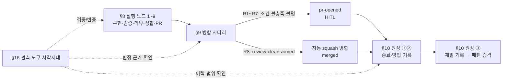

# 하니스 통합 리포트 — §8·§9·§10·§16

> 대상: `내부 문서 `TECH-harness-execution-anatomy-current-state-2026-08-10``의 §8, §9, §10, §16
>
> 기준: 문서에 표시된 자동병합 사다리의 **R1~R8**. 여기서 R1~R7은 `pr-opened`로 넘기는 보류 사유이고, R8은 여섯 조건을 모두 만족하여 `review-clean-armed`로 자동 병합되는 성공 칸이다. 문서의 §9-2 표는 R1~R7과 성공 행을 명시한다. §9-0의 라이브 관측에는 별도/과거 계측 사유 `review-clean-verify-inconclusive`도 있으므로, 이는 현행 도식의 독립 R칸으로 단정하지 않는다.

## SCQA

### S — 관측

하니스는 구현만 하는 직선 실행기가 아니라, **구현 → 검증·리뷰·재작업 → main 정합 → PR → 자동병합 또는 HITL → 원장·관측으로 재판정**하는 폐루프다. §8은 실행 노드, §9는 착지 판정, §10은 이력의 세 저장소, §16은 관측 도구의 사각지대를 각각 확대한다.

### C — 맥락

자동병합은 PR을 열었다는 사실만으로 허용되지 않는다. `autoMerge`, 요구 증거 충족, 신호 완전성, 실제 리뷰 수행, 리뷰 verdict, diff 완전성이라는 여섯 조건이 모두 필요하다. 하나라도 만족하지 못하거나 알 수 없으면 병합 실패로 처리하지 않고 `pr-opened` 상태로 사람(HITL)에게 넘긴다.

### Q — 이 네 절을 통합하면 무엇을 답하는가?

1. 한 런은 실제로 어떤 노드를 어떤 순서로 통과하는가?
2. PR 이후 자동으로 착지할지, 왜 사람에게 넘길지를 어떤 순서로 판정하는가?
3. 그 결과와 실패 재발을 어느 원장에 남기며, 각 원장은 무엇을 답하지 못하는가?
4. 운영자가 이 판정을 검증할 때 어떤 도구의 관측 범위와 한계를 먼저 확인해야 하는가?

### A — 결론

§8·§9·§10·§16은 각각 실행·결정·기억·관측 층을 맡는다. 따라서 R1~R8은 §9의 병합 분기만이 아니라, §8이 만든 판정 입력을 §9가 소비하고, §10이 이력을 남기며, §16이 그 이력과 라이브 상태를 과장 없이 읽게 만드는 **통합 착지 사다리**다.

---

## 1. 통합 사다리 R1~R8

| 칸 | `mergeReason` / 결과 | §9의 질문 | 결과 |
|---|---|---|---|
| **R1** | `no-auto-flag` | 자동병합이 켜졌는가? | 아니오면 `pr-opened` → HITL |
| **R2** | `required-evidence-uncovered` | 골이 이름으로 요구한 증거 태그가 모두 덮였는가? | 아니오면 HITL |
| **R3** | `signal-incomplete` | 최신 신호가 완전한가? | 아니오면 HITL |
| **R4** | `no-real-review` | 리뷰가 실제로 수행되었는가(`reviewed`)? | 아니오면 HITL. “지적 0건”과 다름 |
| **R5** | `review-must-fix` | 실제 리뷰의 verdict가 `fail`이 아닌가? | fail이면 HITL 및 rework 근거 |
| **R6** | `review-diff-truncated` | 리뷰어가 diff 전체를 보았는가? | 잘렸으면 HITL |
| **R7** | `review-diff-budget-unknown` | diff 완전성조차 판정 가능한가? | 모르면 HITL |
| **R8** | `review-clean-armed` | 여섯 병합 조건이 모두 참인가? | 예면 squash 자동병합 → `merged` |

**판정식:**

```ts
canAuto = autoMerge
       && reviewReal
       && review.verdict !== 'fail'
       && reviewDiffComplete
       && !requiredEvidenceMissing
       && !latestSignalIncomplete
```

R1~R7은 “실패”가 아니라 자동 판단을 멈추는 안전한 보류다. 이때 종결은 `pr-opened`이고, 사람에게 판단권을 넘긴다. R8만 자동병합 허가다.

---

## 2. 절별 요약과 R1~R8 접점

### §8 — 파이프라인 노드 아홉 × 모듈 × 액션

**이 절이 답하는 질문:** “한 하니스 런은 실제로 무엇을 하는가? 각 단계는 어느 모듈에서 실행되고, 화면·종결 stage에는 무엇을 남기는가?”

**핵심 내용**

- 9개 노드는 `implement → gate → review → rework → main-sync → regate → typecheck-recheck → open-pr → merge`다.
- `gate` 실패는 바로 종결하지 않고 `rework`로 되먹인다. `review`의 must-fix도 rework를 만든다.
- PR 전에는 `main-sync → regate → typecheck-recheck`의 정합 삼단을 통과한다. 즉, 최초 gate 통과만으로 병합 판단을 하지 않는다.
- `merge`는 두 가지 종결을 가진다. 병합 성공은 `merged`, 자동병합 불허는 `pr-opened`이며 후자는 HITL 전환이다.
- 같은 `gate-failed`가 rework·regate·typecheck-recheck에서 나올 수 있으므로 stage 하나만 보고 실패 위치를 단정할 수 없다.

**R1~R8과의 접점:** **간접 입력 생산층 + R8의 실행 종결층.**

| 사다리 칸 | §8 연결 근거 |
|---|---|
| R1 | 노드 8 `open-pr` 뒤에 병합 관문으로 진입한다. 자동병합 설정이 없으면 노드 9는 병합 대신 `pr-opened`로 끝난다. |
| R2 | `gate`, `regate`, `typecheck-recheck`와 골 검증 산출은 요구 증거가 충분한지 판단할 수 있는 실행 근거를 만든다. 다만 R2의 최종 판정은 §9가 한다. |
| R3 | 하니스 런이 내는 신호·종결 산출이 §9의 신호 완전성 검사 입력이다. |
| R4~R7 | 노드 3 `review`가 `reviewed`, verdict, diff 완전성 정보를 만든다. 리뷰가 실행되지 않았거나 결과·범위가 불완전/불명인 경우 §9가 각각 R4~R7로 분기한다. |
| R8 | 노드 9 `merge`의 성공 종결이 `merged`다. §9가 `review-clean-armed`를 내면 이 노드가 squash 자동병합을 수행한다. |

**통합상 의미:** §8은 병합 판단기가 믿을 수 있는 입력을 만드는 곳이다. 특히 review를 빼면 R4~R7이 성립하지 않고, 정합 삼단을 빼면 R8은 오래된 main 기준의 오판이 된다.

---

### §9 — 후반부: rework · 정합 · PR · 무인 병합

**이 절이 답하는 질문:** “검증 또는 리뷰 문제가 난 뒤 어떻게 고치고 정합하며, PR 이후에는 어떤 순서와 근거로 무인 병합 또는 HITL을 결정하는가?”

**핵심 내용**

- 후반부는 rework, main 정합, 재게이트, 타입 재검증, PR, 무인 병합의 결합이다.
- 병합 관측에는 `verifyByBreaking` 구조화 필드를 싣지만, 현행 라운드는 `canAuto` 임계식을 바꾸지 않고 값을 흐르게 하는 단계다.
- 종료 관측의 필드를 타입으로 강제하여 새 종결 경로가 관측 필드를 빠뜨리면 컴파일 오류가 나게 한다.
- 반복 리뷰 지적은 원문 동일성이 아니라 `reviewFindingKey`로 의미상 반복을 센다.
- 자동병합은 위 표의 여섯 조건을 모두 만족할 때만 가능하며, R1~R7은 모두 `pr-opened`로 전환된다.

**R1~R8과의 접점:** **직접적인 사다리 소유 절.**

| 사다리 칸 | §9 연결 근거 |
|---|---|
| R1 | `autoMerge` 플래그가 꺼진 경우의 최우선 보류 사유다. |
| R2 | 골이 요구한 증거가 덮이지 않았음을 병합 전에 차단한다. |
| R3 | 최신 신호의 불완전성을 자동병합 불허로 취급한다. |
| R4 | `reviewed` 여부를 판정하므로 “리뷰 지적이 없었다”와 “리뷰가 없었다”를 구별한다. |
| R5 | 리뷰 verdict의 must-fix를 자동병합 중단 및 재작업 근거로 쓴다. |
| R6 | 리뷰어가 diff 일부만 본 경우를 명시적으로 차단한다. |
| R7 | diff 완전성 판단 자체가 불명인 경우도 안전하게 차단한다. |
| R8 | 여섯 조건이 모두 참일 때 `review-clean-armed`로 squash 자동병합한다. |

**통합상 의미:** §9는 불확실성을 성공으로 환산하지 않는다. 모르는 것은 R7로, 검증되지 않은 것은 R4/R6으로, 사람이 선택해야 할 것은 `pr-opened`로 보낸다. 이것이 하니스의 무인화 경계다.

---

### §10 — 원장 관리

**이 절이 답하는 질문:** “런의 결과·종료 방식·재발을 어디에 남기고, 각 기록은 어떤 질문과 어떤 공백을 갖는가?”

**핵심 내용**

원장은 하나가 아니라 셋이다.

| 원장 | 기록 주체·형태 | 답하는 질문 | 답하지 못하는 것 |
|---|---|---|---|
| ① 런 원장 | 런 종료 시 자동 기록, `run-ledger/<runId>.jsonl` | 끝났는가, 성공했는가, 몇 라운드였는가, `reviewed`였는가 | 왜 그렇게 되었는가 |
| ② 골-런 스토어 | 종결 레코드 자동 확정, SQLite `GoalExecutionRecord` | 어떻게 끝났는가: stage·goalType·리뷰 계열·PR 번호 | 같은 실패가 재발했는가 |
| ③ 영역 원장 | 사고 때 사람이 `내부 문서 `ISSUES``에 기록 | 같은 자리를 몇 번 밟았는가: 성격·재발·방어 주체 | 자동으로는 생기지 않음 |

- 연합 미완 조회는 원장별 독립 판정의 유령 미완을 runId 가로 대조로 제거한다.
- 반복되면 영역 원장의 사례를 `내부 문서 `PATTERNS``의 교훈으로 승격한다.

**R1~R8과의 접점:** **판정 이력·재발 학습층. 직접 판정하지는 않지만, 모든 칸의 사후 검증과 개선에 필수다.**

| 사다리 칸 | §10 연결 근거 |
|---|---|
| R1~R7 | 자동병합이 보류되어 `pr-opened`로 끝난 이유·stage·리뷰 상태를 원장 ①·②가 남겨, HITL 전환이 설정 부재·증거·신호·리뷰 중 어디에서 생겼는지 추적하게 한다. |
| R4~R7 | 특히 `reviewed`, 리뷰 계열, diff·관측 관련 기록은 “리뷰가 없었는지/실패했는지/범위를 몰랐는지”를 사후 구분하는 근거다. |
| R8 | `merged` 및 PR 번호가 자동 착지의 결과를 확정한다. |
| R1~R8 공통 | 자동 원장은 반복 원인을 완성하지 못한다. 동일한 보류·오판이 재발한 경우에는 사람 원장 ③에 기록하고 패턴으로 승격해야 방어가 누적된다. |

**통합상 의미:** §10은 R칸을 “한 번의 병합 판단”에서 “재발을 학습하는 운영 데이터”로 바꾼다. 다만 원장 하나만 보면 원인을 놓치거나 재발을 놓치므로 셋을 함께 읽어야 한다.

---

### §16 — 관측 툴 전체

**이 절이 답하는 질문:** “하니스의 라이브 상태·이력·화면을 확인할 때 각 도구는 무엇을 알려 주며, 특히 무엇을 보지 못하는가?”

**핵심 내용**

- 이 절의 핵심은 도구 목록이 아니라 **각 도구의 사각지대**다. 부분 관측을 전체 관측으로 오독하지 않게 한다.
- `self unfinished-runs --path`는 자기 트리 우주만 본다.
- `pty list --all --include-test --json`은 다른 트리도 찾지만 살아 있는 PTY만 보며, 멈춘 런은 못 본다.
- `pty snapshot`은 현재 화면을 보지만 짧은 수명의 자식은 폴링으로 놓칠 수 있다.
- `logs --instance`는 레코드에 트리 식별 필드가 없어 모호한 instance를 해결하지 못한다.
- 원장 ①은 종료·라운드를, 원장 ②는 종료 방식을, 원장 ③은 재발을 보지만 어느 하나도 모든 질문에 답하지 못한다.
- 조회 전에는 limit, 표시 절단, 결론 행 위치, JSON Lines 형태, 그리고 “전수”가 어느 우주에 대한 전수인지를 점검해야 한다.

**R1~R8과의 접점:** **사다리 판정의 검증·반증층.**

| 사다리 칸 | §16 연결 근거 |
|---|---|
| R1 | PR은 열렸으나 자동병합이 꺼진 상태인지, 혹은 다른 우주·다른 트리의 런을 보고 있지는 않은지 범위를 먼저 검증하게 한다. |
| R2 | 요구 증거 미충족은 로그·레코드가 어느 우주에서 수집됐는지와 표시 절단 여부를 확인하지 않으면 잘못 판정할 수 있다. |
| R3 | 신호 완전성은 관측 자체의 범위·상한·누락을 함께 검증해야 한다. 관측이 불완전한데 신호만 완전하다고 결론 내릴 수 없다. |
| R4 | `reviewed` 여부는 원장 ①과 종료 기록을 확인해야 하며, 화면 스냅샷만으로 리뷰 수행 여부를 단정할 수 없다. |
| R5 | 리뷰 verdict는 원장 ② 등의 구조화 이력을 읽어야 한다. PTY 생존 여부만으로 must-fix를 판단할 수 없다. |
| R6~R7 | diff 절단/예산 불명은 “값이 없었다”와 “표시에 잘렸다·다른 우주에 있었다”를 구분해야 한다. §16의 JSON·limit·우주 경계 규율이 바로 그 반증 장치다. |
| R8 | `merged`를 관측할 때도 하나의 화면이나 현재 PTY만으로 확정하지 않고, 종결 원장·PR 기록·관측 우주를 교차 확인해야 한다. |

**통합상 의미:** §16은 R1~R8을 새로 결정하지 않는다. 대신 “어떤 R칸에 도달했다”는 운영자의 결론이 도구의 사각지대 때문에 틀리지 않도록, 관측의 전제와 한계를 드러낸다.

---

## 3. 하니스 통합 흐름



## 4. 운영 결론

- **§8 없이는 §9가 판단할 입력이 없다.** 리뷰·재게이트·타입 재검증을 실제 노드로 통과해야 R2~R7과 R8이 의미를 갖는다.
- **§9 없이는 §8의 결과가 안전하게 착지하지 않는다.** 자동화를 원하더라도 불확실성은 R1~R7로 명시해 HITL에 넘긴다.
- **§10 없이는 판단이 누적 학습으로 바뀌지 않는다.** 자동 이력은 종료와 방식을, 사람 원장은 재발과 방어 주체를 보완한다.
- **§16 없이는 위 세 층의 관측이 과신된다.** 우주·트리·PTy 생존·표시 절단·limit을 먼저 확인해야 “없음”, “전수”, “병합됨” 같은 결론이 성립한다.

즉 하니스 통합의 핵심은 “자동병합 성공률”이 아니라, **실행 근거를 만든 뒤(R8 포함) 자동판정 가능성만 기계에 맡기고, 근거 부족·불명은 명시적인 R1~R7로 남겨 기록·관측·HITL의 폐루프로 회수하는 것**이다.
